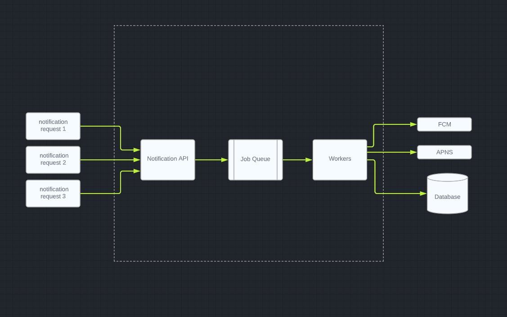

# Notifications API with NodeJS

## API Architecture Design


## Prerequisites
My node version ``` v16.16.0 ``` <br />
My npm version  ``` 8.13.2 ```

## Installation

Make sure you have [nodejs](https://nodejs.dev/en/download/) installed.

Just run the following command to install npm packages:

```bash
npm install
```

Make sure you have access to [redis](https://redis.io/) server and you have to edit the redis credentials in the <a href="./.env">.env</a> file. 

```
REDIS_HOST = {Your_Redis_Host}
REDIS_PORT = {Your_Redis_Port} 
```

## 🚀 Usage

```bash
node index.js
```

## Test

Make a post request to {url}/api/notifications/send with the following body

```json
{
    "message": "your message",
    "users":[1, 2, 3, 4, 5, 6] // the sample data contains 6 users with ids from 1 : 6 
}
```